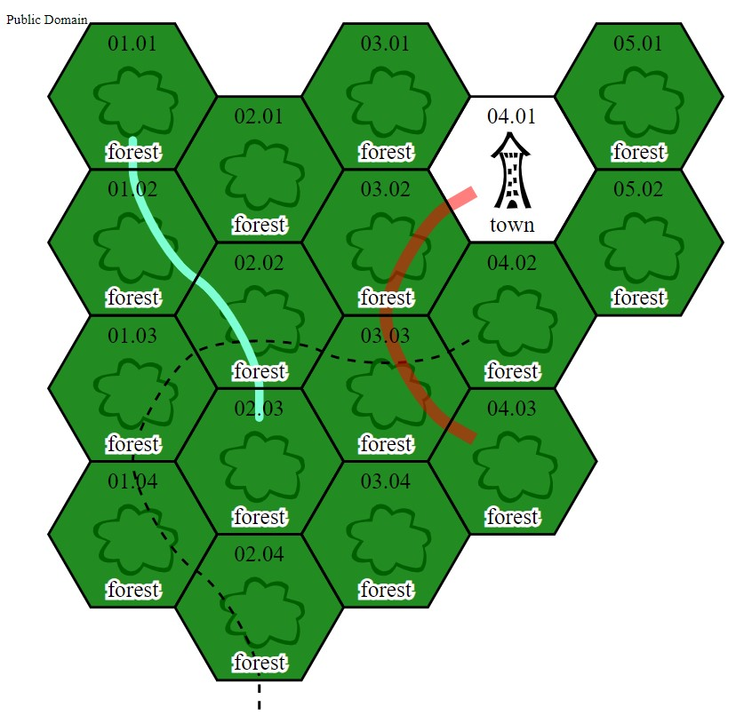

---

layout: post
title:  "Vecchio Carnevale Blogghereccio: Foreste"
author: "zeruhur"
comments: true
tags: [osr, vecchio carnevale blogghereccio]
categories: comunicazioni
image:

---

Il [Vecchio Carnevale Blogghereccio](https://oicn.icu/2021/Vecchio-Carnevale-Blogghereccio/) è arrivato al suo quinto mese di vita e dopo il tema di maggio (["kenku"](https://write.as/jonnie/nel-polo-delle-liberta-ci-sono-i-falchi-e-le-colombe-me-il-denominatore)), il testimone passa a me per questo mese di giugno e il nuovo tema: **Foreste**.
Se volete consultare l'archivio dei contributi precedenti lo trovate [**QUI**](https://carnevale-zine.github.io/archivio/)

# Foreste

Una decina di milioni di anni fa i nostri antenati vivevano sugli alberi, fino a quando qualche esemplare non decise che era una buona idea scendere e iniziare a camminare (in realtà è molto probabile che i cambiamenti climatici del Rift Africano costrinsero a un veloce adattamento di questi individui che si avventurarono nella savana).

Da allora la nostra specie ha avuto un rapporto ambivalente con le foreste. Luogo sacro (come il bosco di Nemi da cui parte la dotta analisi di Frazer) o dimora di paure ancestrali (come la selva oscura di dantesca memoria). Fonte di vita e rifugio di creature maligne e benigne. Prettamente un luogo selvaggio, non antropizzato se non in tempi recenti, ultimo rifugio di una natura incontaminata e non governata dal laborio umano.

Vorrei dire che il mio rapporto con le foreste sia personale e intimo, ma la verità è che, da buon figlio di gente di pianura e di mare, il mio primo approccio alle lande boscose è stato quello della fiaba: Cappuccetto Rosso, Hansel & Gretel. Racconti in cui la foresta ciela orribili pericoli e creature malvagie. E il massimo che potevo fare, da buon bimbo pusillanime, era avventurarmi nel bosco sui colli liguri, sempre accompagnato dai nonni e sempre di giorno. Dopo il tramonto il limitare di quel sentiero diventava un luogo di terrore.

Poi arrivò *Robin Hood: Principe dei ladri* e la mia immagine mentale della foresta cambiò radicalmente: la comunità allegra e libera dal giogo della nobiltà abietta, le dimore sospese sugli alberi, il richiamo dell'avventura.

Quando è stato il momento di scegliere il tema di questo mese "le foreste" è sorto inconscio e spontaneo, senza calcolo o razionale.

In ottica ruolistica, le foreste sono una parte importante del sandbox e del hexcrawl: in fondo non sono uno dei tipi standard di "terre selvagge"? Perché fuori da quell'esagono al centro della mappa, la città o il villaggio di partenza, chi non si immagina da qualche parte nelle vicinanze una tenebrosa e impervia foresta frequentata o infestata da creature ibride o mostruose (fate, folletti, elfi, gnomi, draghi, giganti, streghe, orchi, troll...).

Oppure una variante classica con le creature che ci offre *Mazes & Minotaurs*, riprese a mani piene dalla mitologia classica: ninfe, satiri, centauri...

Oppure, virando al weird, come la strana foresta di *Black God's Kiss* di C.L. Moore.

Ma io cito almeno una variazione originale e interessante, il Mare della putrefazione di *Nausicaä della Valle del vento*: un luogo apparentemente letale e da contenere (inutilmente), eppure ricolmo di vita bizzarra e fondamentale per guarire una Terra devastata dalla follia e dai veleni umani. C'è da prendere spunto dall'ecologia di Miyazaki, per ricordarci che non dobbiamo essere pigri nel pensare alle *nostre* foreste.

Che siano igrofile, mesofile o xerofile, conifere o latifoglie, decidue o sempreverdi create delle belle foreste. I vostri giocatori e i nostri lettori gradiranno sicuramente.

# Come Partecipare

- Innanzitutto, leggetevi di cosa stiamo parlando e come funziona, spiegato [qui](https://carnevale.itch.io/vecchio-carnevale-blogghereccio).
- Poi, se non ce l'avete già, apritevi un blog (Google è vostro amico, ci sono diverse piattaforme gratuite che possono ospitarlo come Blogger di Google oppure GitHub Pages che ospita Il Tempio di Syrinx).
- Sbizzarritevi a scrivere quello che volete seguendo questo tema.
- Nel vostro contributo linkate questo stesso post per far girare l'iniziativa, e far capire di che si sta parlando.
- Una volta pubblicato, contattatemi e datemi il link del vostro post (potete usare i commenti qui sotto, altrimenti potete contattarmi su telegram @zeruhur)
- Poco dopo la fine di giugno, provvederò a postare la raccolta di tutti i partecipanti.

IMPORTANTE: Tutte le entry di questo mese vorrebbero essere utilizzate per pubblicare una piccola zine riassuntiva del mese del Vecchio Carnevale Blogghereccio.
Se volete partecipare ricordate di aggiungere la possibilità di utilizzare il vostro articolo aggiungendo una specifica di licenza o permesso di utilizzo per la stessa oppure scrivendolo nel messaggio di consegna del link (esempio: licenza CC-BY-SA 4.0)

Ovviamente se volete partecipare al Carnevale ma non alla zine siete comunque i benvenuti!

Ricordate: avete tempo dal 1 al 30 giugno per pubblicare!